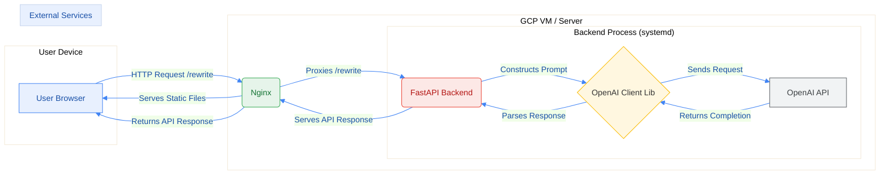

# Cross-Cultural Email Assistant

An AI-powered web application that rewrites emails to align with the communication style, etiquette, and tone of the recipient's culture.

## Description

Navigating cross-cultural communication can be challenging. This tool helps users adapt their emails to be more effective and appropriate when communicating with individuals from different cultural backgrounds. Users input their original email, select the target culture, and optionally specify a tone emphasis. The application then leverages a Large Language Model (LLM) via the OpenAI API to rewrite the email and provides notes explaining the cultural adaptations made.

## Architecture Overview

The application follows a standard client-server architecture:

1.  **Frontend (React):** Provides the user interface, captures user input (original email, target culture, tone), and sends API requests to the backend.
2.  **Backend (FastAPI):** Exposes a REST API endpoint (`/rewrite`). It receives requests from the frontend, constructs a detailed prompt including the original email and cultural guidance, interacts with the OpenAI API to get the rewritten email and cultural notes, parses the response, and sends the results back to the frontend.
3.  **Nginx (Deployment):** Acts as a reverse proxy, serving the static React frontend files and forwarding API requests (`/rewrite`) to the FastAPI backend service.
4.  **OpenAI API:** The external service providing the LLM capabilities for rewriting the email content.

## Features

* **Email Input:** Text areas for original email subject and body.
* **Target Culture Selection:** Dropdown menu to choose the recipient's culture (e.g., Japan, U.S., U.K., France, India, Germany).
* **Tone Emphasis (Optional):** Select desired emphasis (Clarity, Formality, Urgency, Respect).
* **AI-Powered Rewriting:** Uses OpenAI's `gpt-4o-mini` (or other configured model) to rewrite the email based on cultural guidance.
* **Output Display:** Shows the rewritten subject and body clearly.
* **Cultural Notes:** Provides explanations for the changes made, highlighting cultural considerations.
* **Responsive UI:** Frontend designed to work on different screen sizes.

## Tech Stack

* **Frontend:** React (with TypeScript), CSS Modules (or TailwindCSS), Axios
* **Backend:** Python, FastAPI, Uvicorn
* **AI Model:** OpenAI API (`gpt-4o-mini` or other GPT models)
* **Web Server/Proxy (Deployment):** Nginx
* **Process Management (Deployment):** systemd
